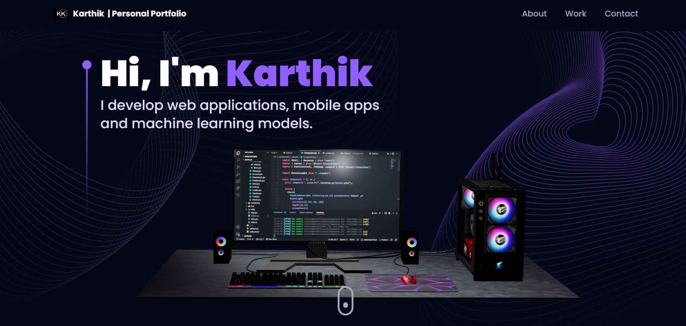

# Portfolio Website

A personal portfolio website showcasing my projects and skills, built using React.js, Three.js, Framer Motion, and other tools.

## Overview

This portfolio website serves as a showcase for my projects and skills. It's designed to provide a visually appealing and interactive experience for visitors. The website utilizes modern web technologies, including React.js, Three.js, and Framer Motion, to create a seamless user interface.

## Features

- Interactive 3D elements powered by Three.js to enhance visual engagement.
- Smooth animations and transitions implemented with Framer Motion for a dynamic user experience.
- Project sections highlighting various projects I've worked on.
- About Me section describing my background, skills, and interests.
- Contact information for reaching out to me.

## Technologies Used

- React.js for building the user interface components.
- Three.js for creating and rendering 3D elements.
- Framer Motion for adding animations and transitions.
- Other web development tools and libraries for styling and functionality.

## Dependencies

This project utilizes the following dependencies:

- `@emailjs/browser`: Version 3.11.0
- `@react-three/drei`: Version 9.65.5
- `@react-three/fiber`: Version 8.12.2
- `framer-motion`: Version 10.12.4
- `maath`: Version 0.5.3
- `react`: Version 18.2.0
- `react-dom`: Version 18.2.0
- `react-router-dom`: Version 6.10.0
- `react-tilt`: Version 1.0.2
- `react-vertical-timeline-component`: Version 3.6.0
- `three`: Version 0.151.3

Getting Started

1. Clone the repository: `git clone https://github.com/lelouch248/portfolio_website.git`
2. Navigate to the project directory: `cd portfolio_website`
3. Install dependencies: `npm install`
4. Start the development server: `npm start`
5. Open your browser and go to `http://localhost:3000` to view the website.

Contributions

Contributions and suggestions are welcome! If you find any issues or have improvements to propose, feel free to create a pull request.

License

This project is licensed under the MIT License - see the [LICENSE](LICENSE) file for details.

For more details and to view the live website, visit [Portfolio Website](https://github.com/lelouch248/portfolio_website).

